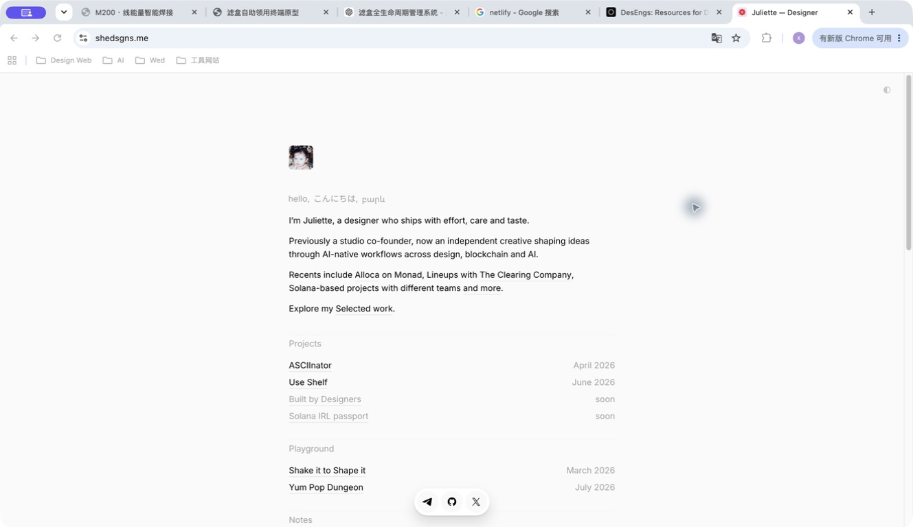
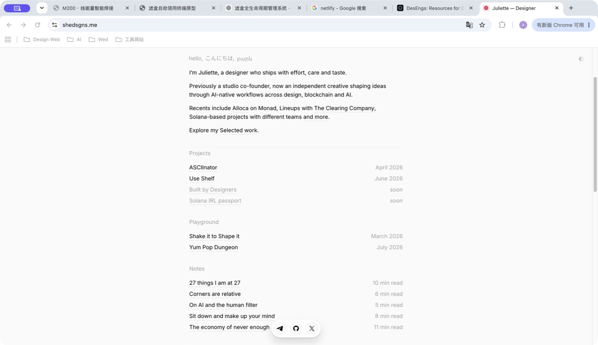
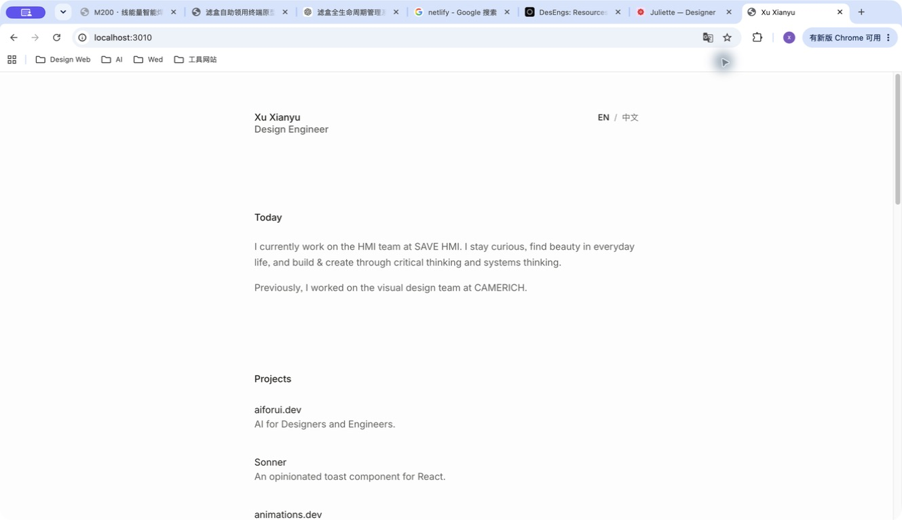

# 首页优化观察与建议

日期：2026-09-09。阶段：了解与规划，未修改应用代码。

## 本次观察

1. 参考首页顶部：结构清晰。头像在正文列起点，头像上方留白充分，身份介绍集中。实际明暗切换按钮位于视口右上角。

2. 参考首页列表与滚动状态：易于扫描。分区名为浅灰色，项目名左对齐、日期右对齐；Notes 使用阅读时长。底部 Telegram、GitHub、X 快捷入口在两个滚动位置均可见。它是外链 Dock，而非页面内容 Tabs。

3. 当前首页：简洁基础良好，留白分配可改进。姓名与 Today 间、内容区之间空白较大；列表采用标题加描述，占用较多纵向空间。没有头像、明暗切换或固定 Dock。

## 项目现状

- React 19 + TypeScript + Vinext/Vite，采用 app 路由。
- 首页入口 app/page.tsx；主体 components/reference-home.tsx；样式 app/minimal.css。
- components/minimal-header.tsx 同时服务首页与文章阅读页，调整时需明确首页变体。
- 已有中英文切换及本地偏好记忆。
- About、Contact、Journal、Writing 详情以及作品详情已有路由。
- 项目和多数文章仍是 Emil 的参考内容；个人简介与一篇原创文章已替换。
- 项目数据没有日期字段；当前 public 资源中未发现明确的个人头像。
- 工作区已有未提交修改，本次未改动。

## 建议方向（待讨论）

保留暖白底、单栏、现有字体和双语。顶部留白集中，身份区连贯，分区更轻，列表更紧凑。

| 部分 | 第一版建议 |
| --- | --- |
| 顶部与头像 | 内容宽度先试 600–640px；桌面头像距页面顶部约 120–160px，手机约 72–96px；头像 40–48px。姓名、职业与简介归为连续区域，缩短原有 128px 断层。数值为方案起点，并非参考站实测值。 |
| 工具位置 | 左上角放明暗切换，与右侧语言切换组成轻量工具区；优先与内容列边缘对齐。支持系统主题与用户选择记忆。 |
| 分区标题 | Projects、Writing 等改为较轻的中性灰；正文和可点击标题保持清晰。区块间距先试 64–80px。 |
| 列表 | Projects 第一行为左标题、右日期；确有信息价值的简短描述可留在第二行。Writing 可采用相同对齐方式，但元信息按内容需要选日期或阅读时长。日期缺失时留空，不编造。 |
| 底部 Dock | 固定居中胶囊，建议先选 3–4 个有效入口。可用首页、文章、联系；若偏社交入口则使用本人真实外链。悬浮提示、键盘焦点和手机安全区一并考虑，页面底部预留足够空间。 |

## 内容与范围

头像素材、项目真实日期、本人社交链接需要在落地前补齐。Newsletter 当前仅为预览表单，More 仍指向参考作者；建议首页内容整理时替换或移除。

建议先定身份区与 Dock 职责，再做首页布局、层级和列表，最后接入主题与 Dock 交互。无需新建路由或改造原有 About/Contact/Journal 页面。

## 观察限制

已核对桌面实际画面和首页源代码，未测试移动端、明暗切换后的画面或完整键盘操作。浅色标题需在实际配色下测量对比度；截图不足以判断完整无障碍合规性。
