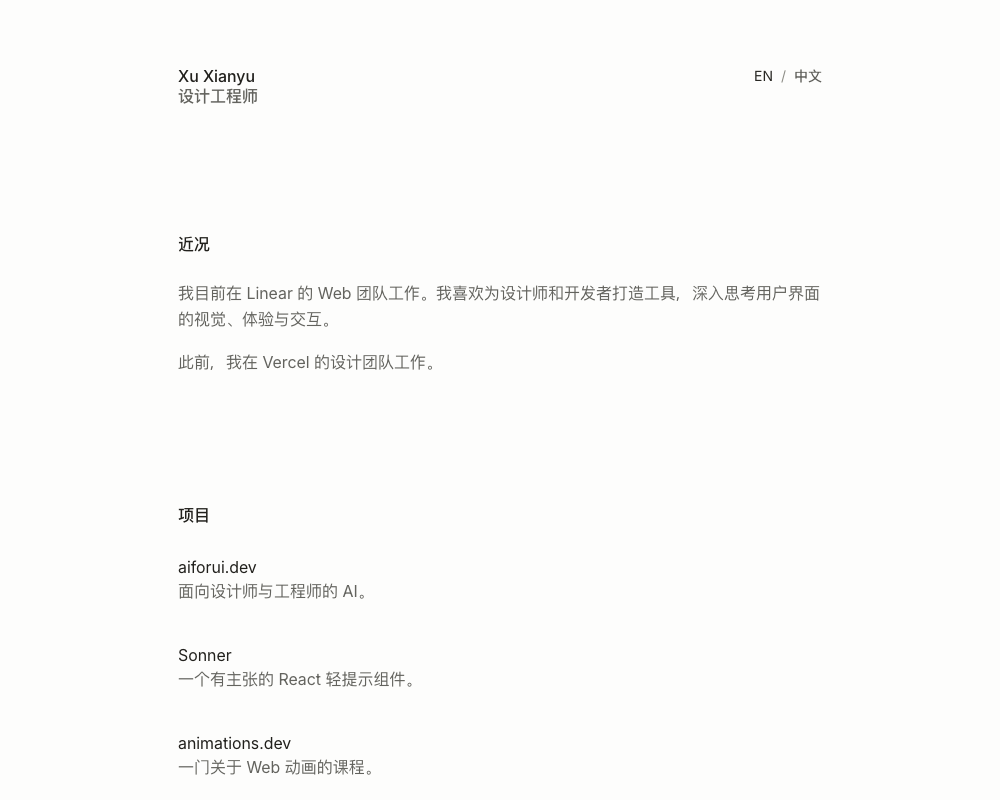
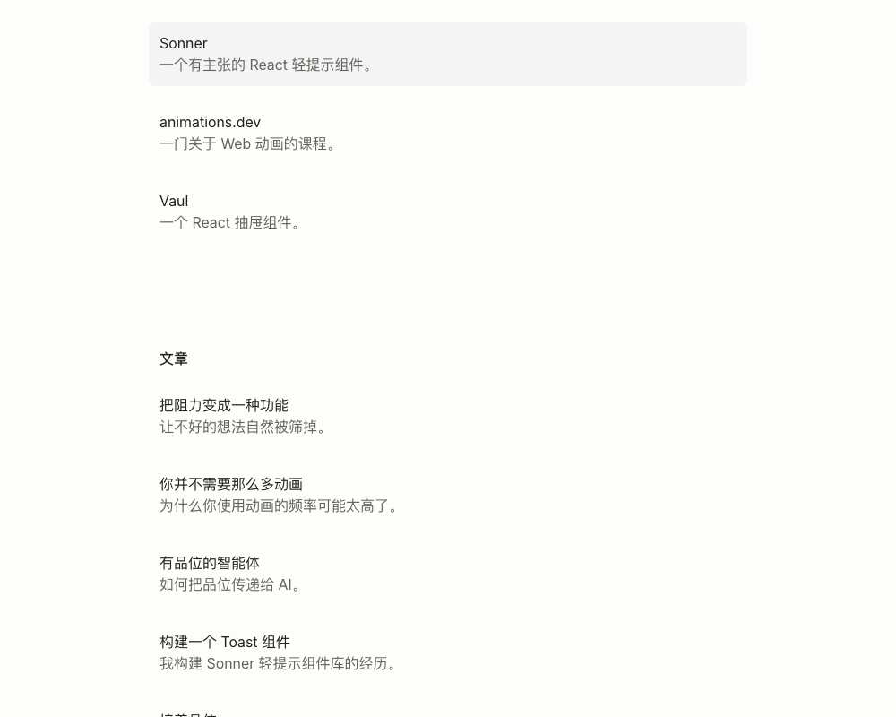
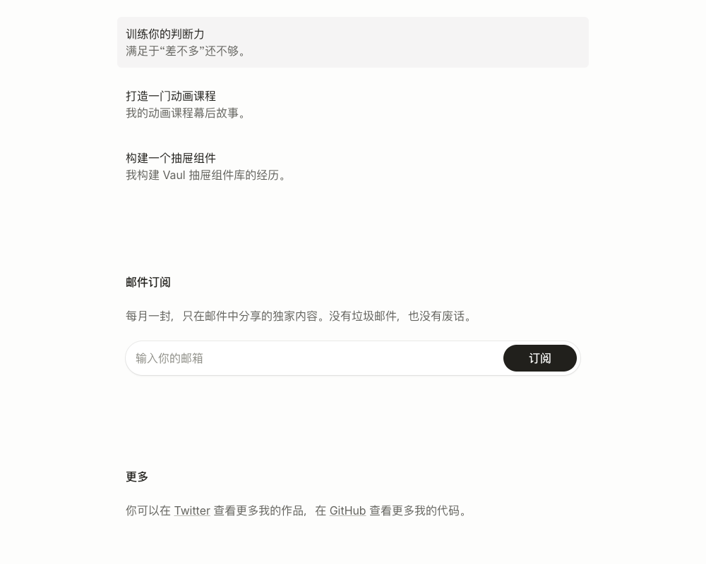

# 当前网站结构分析

日期：2026-09-09。依据：当前分支 `codex/emil-minimal` 的代码、实际首页截图及当前 DOM 链接。

结论：当前是单页个人主页，加上尚未从新首页接入的旧版内页。首页的信息顺序清楚，适合沿用；内容归属、站内跳转和联系入口尚待个人化。

## 1. 认识你并查看项目：布局清晰，内容待替换

顶部是 Xu Xianyu、设计工程师，以及中英文切换。随后是近况简介和四个项目。
姓名和身份已经个人化。近况中的 Linear/Vercel 工作经历以及四个项目仍是参考内容，不能视为用户真实经历。项目链接全部跳往站外，未接入已有 Ambient Dial 概念详情。

建议：首先填写真实近况；首页精选 3–5 个自己的项目，用一句话说明问题与贡献，再链接到站内详情或可体验的项目。

## 2. 阅读文章：目录易扫描，当前链接去往原站

十篇文章采用标题与一句简介的列表，信息层级一致。数量使文章区成为首页较长的部分。当前所有文章均链接到参考作者的网站；旧版站内 Journal 列表和三篇 Markdown 示例文章未被接入。

建议：以后首页保留少量真实文章；文章积累后再从首页增加“全部文章”链接到 `/journal`。中英文目前只作用于首页，站外文章与旧内页没有同步翻译。

## 3. 建立联系：有订阅与社交链接，直接联系入口缺失

邮件订阅是本地表单演示，代码未调用订阅后端；提交后明确提示未发送。更多区域仍链接到参考作者的 Twitter 和 GitHub。当前首页没有用户本人的邮箱或进入 `/contact` 的链接。

建议：如果尚无定期邮件内容，暂时移除 Newsletter；把 More 改为 Contact / 联系，填写真实邮箱和常用平台。这能让访客在了解作品后直接发起联系。

## 项目内现有页面

| 路径 | 内容 | 与首页关系 |
| --- | --- | --- |
| `/` | 新的双语极简主页 | 当前主要入口 |
| `/about` | 旧版经历时间线 | 首页无入口 |
| `/contact` | 旧版动态联系方式与流体页脚 | 首页无入口 |
| `/journal` | 旧版文章列表与预览 | 首页 Writing 未指向它 |
| `/journal/[slug]` | Markdown 示例文章详情 | 经旧版 Journal 访问 |
| `/work/ambient-dial` | 示例项目详情 | 首页 Projects 未指向它 |

旧内页仍使用原来的导航、视觉样式与示例资料。这是渐进改版中的两套结构共存，不代表访客目前需要浏览这么多页面。后续接回首页前应统一内页风格和内容。

## 建议的最终内容顺序

身份与语言 → 近况 → 精选项目 → 文章 → 联系。

项目与文章按需要进入详情页；较完整的经历可由简介中的小链接进入 About。首页不必一次容纳所有经历和所有文章。

## 内容维护位置

- `components/reference-home.tsx`：首页区块与语言切换、表单行为。
- `lib/home-copy.ts`：双语简介、身份、栏目名与表单文案。
- `lib/reference-home.ts`：双语项目和文章条目及链接。
- `app/minimal.css`：新首页样式。

## 可访问性和检查边界

当前 DOM 有标题层级、语言按钮的选中状态与邮箱标签，结构具备基本语义。中文首页链接进入英文站外文章会产生语言切换，后续可在文章条目注明语言。此次为信息架构审阅，没有重新开展全面键盘、屏幕阅读器、移动端或对比度测试；不作完整可访问性合规结论。旧内页关系依据代码确认，本次截图只覆盖当前首页。未修改网站代码。
